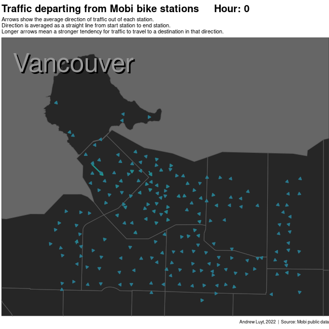
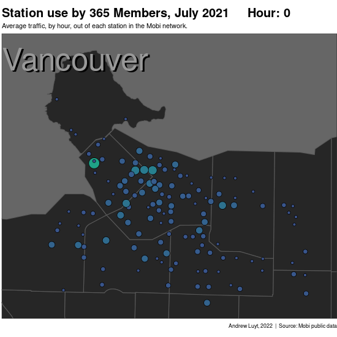
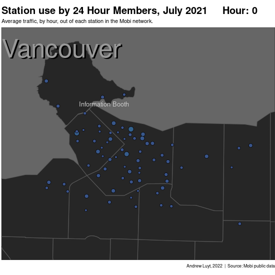
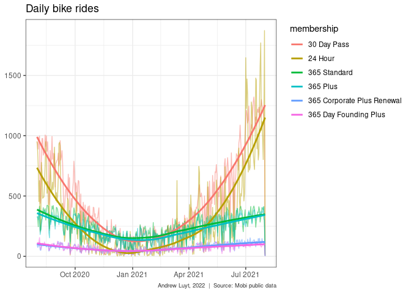

A Brief Analysis of Mobi's Public Dataset
================
Andrew Luyt
2022-01-17

# Summary

This notebook is a quick analysis of 
[the public dataset](https://www.mobibikes.ca/en/system-data) of Mobi, a 
bike-sharing company in Vancouver, Canada. The data cover one year from August 
1, 2020 to July 31, 2021.  Three aspects will be covered:

- Traffic flow estimation
- Mapping the popularity of individual stations
- Seasonal variation in bike use

# Traffic flow

To visualize how bicycle traffic flows around the Mobi system, this animation
finds all the trips taken from each bike station and shows the "average
trip" as an arrow. The longer the arrow, the stronger the tendency for
riders to travel in that direction. A very short arrow
means riders are traveling in *all* directions with no clear pattern. Brighter
colours mean more traffic.

<!-- -->

An interesting pattern is that most traffic flows *towards* downtown, on average.
A notable exception is the group of stations on the eastern side of Stanley Park which
are often used to start a tour around the seawall.

# Which stations are busiest?

We'll examine the traffic at all stations hourly, considering two types of riders:
those who hold **365** passes (*365 Standard, 365 Corporate*, etc) and are 
likely commuters, and those on 24-hour passes who are more likely to be casual 
users or tourists. First, holders of **365** passes: 

<!-- -->

Traffic is concentrated downtown and
has pulses of activity around 8am and 4pm, corresponding to rush hour. There
is also an interesting pulse of late-night activity near Second Beach on the
western side of Stanley Park that might merit further investigation at
another time.

Next, 24-hour pass holders: 

<!-- -->

Traffic for these riders starts later in the day
and is concentrated in stations around Stanley Park and the 
Vancouver seawall.  The station at the Stanley Park information
booth is in particularly high demand.  All of these observations support the
idea that 24-hour passes are often purchased by people seeking recreation.

# Seasonal variation in bike use

Finally we'll plot the number of rides taken each day over one year, 
colouring by membership.  

We see a clear distinction between two types of riders: those who
ride all through the year, and those who prefer the warmer months. People
who purchase *24 Hour* or *30 Day* passes have a very strong preference to
do so in the summer months, whereas the various types of *365* riders seemingly
commute with their bikes year-round.

<!-- -->
